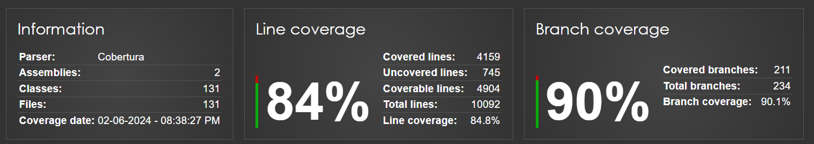

<p align="center">
    <h1 align="center">GENSPARK-MINI-PROJECT</h1>
</p>
</p>
<p align="center">
	
	
	
	
<hr>
	
[](https://github.com/neeraj779/GenSpark-Mini-Project/actions/workflows/github-code-scanning/codeql)
	
## 🔗 Quick Links

> - [📍 Overview](#-overview)
> - [📦 Features](#-features)
> - [📂 Repository Structure](#-repository-structure)
> - [🚀 Getting Started](#-getting-started)
>   - [⚙️ Installation](#️-installation)
>   - [🤖 Running GenSpark-Mini-Project](#-running-GenSpark-Mini-Project)
>   - [🧪 Tests](#-tests)
> - [📊 Code Coverage Report](#-code-coverage-report)
> - [📝 API documentation](#-api-documentation)

---

## 📍 Overview

This repository contains the codebase for the GenSpark Mini Project. The project is a Student Management System that allows users to manage students, teachers, courses, enrollments, assignments, and class attendance. The project is built using ASP.NET Core and Entity Framework. The project is divided into multiple modules, each of which is responsible for managing a specific aspect of the system. The project also includes a test project that contains unit tests for the repository and service classes.

---

## 📦 Features

The Student Management System provides the following features:

- User Management
  - Register a new user
  - Login
  - Activate/Deactivate user

- Student Management
    - Register a new student
    - Update student details
    - Get student details
    - Get all students
    - Update Student Email
    - Update Student Phone
    - Update Student Status
    - Delete student

- Teacher Management
    - Register a new teacher
    - Update teacher details
    - Get teacher details
    - Get all teachers
    - Update Teacher Email
    - Update Teacher Phone
    - Delete teacher

- Course Management
    - Add a new course
    - Update course details
    - Get course details by course code
    - Get all courses
    - Update course credits
    - Delete course

- Course Offering Management
    - Assign a teacher to a course offering
    - Unassign teacher from course offering
    - Update teacher for course offering
    - Get course offering by teacher Id
    - Get course offering by course code
    - Get all course offerings

- Enrollment Management
    - Enroll a student in a course
    - Unenroll a student from a course
    - Get all enrollments
    - Get all enrollments for a student
    - Get all enrollments for a course

- Assignment Management
    - Create a new assignment
    - Update assignment due date
    - Get assignment by Id
    - Get all assignments
    - Delete assignment

- Assignment Submission Management
    - Submit an assignment
    - Get Assigned Assignments
    - Get assigned assignments by course
    - Get all submissions for an assignment and student
    - Get submitted assignments for a student
    - Get status of an assignment submission

- Class Management
    - Add a new class
    - Update class time
    - Get class details
    - Get all classes
    - Delete class

- Class Attendance Management
    - Mark student attendance for a class
    - Update atendance status for a student
    - Get class attendance details
    - Get class attendance for a student
    - Get attendance for a class
    - Get attendance by class and student
---

## 📂 Repository Structure

```sh
└── GenSpark-Mini-Project/
    ├── API-documentation.pdf
    ├── API.postman_collection.json
    ├── CodeCoverageReport.png
    ├── LICENSE
    ├── README.md
    ├── StudentManagementAPI
    │   ├── Contexts
    │   │   └── StudentManagementContext.cs
    │   ├── Controllers
    │   │   ├── AssignmentController.cs
    │   │   ├── AssignmentSubmissionController.cs
    │   │   ├── ClassAttendanceController.cs
    │   │   ├── ClassController.cs
    │   │   ├── CourseController.cs
    │   │   ├── CourseOfferingController.cs
    │   │   ├── EnrollmentController.cs
    │   │   ├── StudentController.cs
    │   │   ├── TeacherController.cs
    │   │   └── UserController.cs
    │   ├── Exceptions
    │   │   ├── AssignmentAlreadyExistsException.cs
    │   │   ├── ClassAlreadyExistsException.cs
    │   │   ├── ClassAttendanceAlreadyExistsException.cs
    │   │   ├── CourseAlreadyExistsException.cs
    │   │   ├── CourseOfferingAlreadyExistsException.cs
    │   │   ├── DuplicateAssignmentSubmissionException.cs
    │   │   ├── DuplicateUserException.cs
    │   │   ├── DuplicateUserNameException.cs
    │   │   ├── InvalidAttendanceStatusException.cs
    │   │   ├── InvalidFileExtensionException.cs
    │   │   ├── InvalidLoginException.cs
    │   │   ├── InvalidRoleException.cs
    │   │   ├── InvalidStudentStatusException.cs
    │   │   ├── NoAssignmentFoundException.cs
    │   │   ├── NoClassAttendanceFoundException.cs
    │   │   ├── NoClassFoundException.cs
    │   │   ├── NoCourseFoundException.cs
    │   │   ├── NoCourseOfferingException.cs
    │   │   ├── NoEnrollmentFoundException.cs
    │   │   ├── NoLinkedAccountException.cs
    │   │   ├── NoStudentFoundException.cs
    │   │   ├── NoSuchAssignmentException.cs
    │   │   ├── NoSuchAssignmentSubmissionException.cs
    │   │   ├── NoSuchClassAttendanceException.cs
    │   │   ├── NoSuchClassException.cs
    │   │   ├── NoSuchCourseException.cs
    │   │   ├── NoSuchCourseOfferingException.cs
    │   │   ├── NoSuchEnrollmentException.cs
    │   │   ├── NoSuchStudentException.cs
    │   │   ├── NoSuchSubmissionException.cs
    │   │   ├── NoSuchTeacherException.cs
    │   │   ├── NoSuchUserException.cs
    │   │   ├── NoTeacherFoundException.cs
    │   │   ├── NoUserFoundException.cs
    │   │   ├── NotEnrolledInAnyCourseException.cs
    │   │   ├── NotEnrolledInCourseException.cs
    │   │   ├── StudentAlreadyEnrolledException.cs
    │   │   ├── UnableToAddException.cs
    │   │   ├── UserNotActiveException.cs
    │   │   └── UserNotPartOfInstitutionException.cs
    │   ├── Interfaces
    │   │   ├── IAssignmentService.cs
    │   │   ├── IAssignmentSubmissionService.cs
    │   │   ├── IClassAttendanceService.cs
    │   │   ├── IClassService.cs
    │   │   ├── ICourseOfferingService.cs
    │   │   ├── ICourseService.cs
    │   │   ├── IEnrollmentService.cs
    │   │   ├── IRepository.cs
    │   │   ├── IStudentService.cs
    │   │   ├── ITeacherService.cs
    │   │   ├── ITokenService.cs
    │   │   ├── IUserRepository.cs
    │   │   └── IUserService.cs
    │   ├── Migrations
    │   │   ├── 20240602091231_initial.Designer.cs
    │   │   ├── 20240602091231_initial.cs
    │   │   └── StudentManagementContextModelSnapshot.cs
    │   ├── Models
    │   │   ├── DBModels
    │   │   │   ├── Assignment.cs
    │   │   │   ├── Class.cs
    │   │   │   ├── ClassAttendance.cs
    │   │   │   ├── Course.cs
    │   │   │   ├── CourseOffering.cs
    │   │   │   ├── Enrollment.cs
    │   │   │   ├── Student.cs
    │   │   │   ├── Submission.cs
    │   │   │   ├── Teacher.cs
    │   │   │   └── User.cs
    │   │   ├── DTOs
    │   │   │   ├── AssignmentDTO.cs
    │   │   │   ├── AssignmentSubmissionResultDTO.cs
    │   │   │   ├── AssignmentSubmisssionDTO.cs
    │   │   │   ├── AssignmentSubmisssionReturnDTO.cs
    │   │   │   ├── AssignmentUpdateDTO.cs
    │   │   │   ├── ClassAttendanceDTO.cs
    │   │   │   ├── ClassAttendanceReturnDTO.cs
    │   │   │   ├── ClassRegisterDTO.cs
    │   │   │   ├── ClassReturnDTO.cs
    │   │   │   ├── CourseDTO.cs
    │   │   │   ├── CourseOfferingDTO.cs
    │   │   │   ├── CreateAssignmentDTO.cs
    │   │   │   ├── EnrollmentDTO.cs
    │   │   │   ├── EnrollmentReturnDTO.cs
    │   │   │   ├── LoginReturnDTO.cs
    │   │   │   ├── RegisteredUserDTO.cs
    │   │   │   ├── StudentRegisterDTO.cs
    │   │   │   ├── StudentReturnDTO.cs
    │   │   │   ├── TeacherRegisterDTO.cs
    │   │   │   ├── TeacherReturnDTO.cs
    │   │   │   ├── UpdateClassDTO.cs
    │   │   │   ├── UpdateEmailDTO.cs
    │   │   │   ├── UpdatePhoneDTO.cs
    │   │   │   ├── UserLoginDTO.cs
    │   │   │   └── UserRegisterDTO.cs
    │   │   └── ErrorModel.cs
    │   ├── Program.cs
    │   ├── Properties
    │   │   └── launchSettings.json
    │   ├── Repositories
    │   │   ├── AssignmentRepository.cs
    │   │   ├── AssignmentSubmissionRepository.cs
    │   │   ├── ClassAttendanceRepository.cs
    │   │   ├── ClassRepository.cs
    │   │   ├── CourseOfferingRepository.cs
    │   │   ├── CourseRepository.cs
    │   │   ├── EnrollmentRepository.cs
    │   │   ├── StudentRepository.cs
    │   │   ├── TeacherRepository.cs
    │   │   └── UserRepository.cs
    │   ├── Services
    │   │   ├── AssignmentService.cs
    │   │   ├── AssignmentSubmissionService.cs
    │   │   ├── ClassAttendanceService.cs
    │   │   ├── ClassService.cs
    │   │   ├── CourseOfferingService.cs
    │   │   ├── CourseService.cs
    │   │   ├── EnrollmentService.cs
    │   │   ├── StudentService.cs
    │   │   ├── TeacherService.cs
    │   │   ├── TokenService.cs
    │   │   └── UserService.cs
    │   ├── StudentManagementAPI.csproj
    │   ├── StudentManagementAPI.xml
    │   ├── appsettings.Development.json
    │   ├── appsettings.json
    │   └── log4net.config
    ├── StudentManagementAPITest
    │   ├── RepositoryUnitTest
    │   │   ├── AssignmentRepositoryTest.cs
    │   │   ├── AssignmentSubmissionRepositoryTest.cs
    │   │   ├── ClassAttendanceRepositoryTest.cs
    │   │   ├── ClassRepositoryTest.cs
    │   │   ├── CourseOfferingRepositoryTest.cs
    │   │   ├── CourseRepositoryTest.cs
    │   │   ├── EnrollmentRepositoryTest.cs
    │   │   ├── StudentReposiotryTest.cs
    │   │   ├── TeacherRepositoryTest.cs
    │   │   └── UserRepositoryTest.cs
    │   ├── ServiceUnitTest
    │   │   ├── AssignmentServiceTest.cs
    │   │   ├── AssignmentSubmissionServiceTest.cs
    │   │   ├── ClassAttendanceServiceTest.cs
    │   │   ├── ClassServiceTest.cs
    │   │   ├── CourseOfferingServiceTest.cs
    │   │   ├── CourseServiceTest.cs
    │   │   ├── EnrollmentServiceTest.cs
    │   │   ├── StudentServiceTest.cs
    │   │   ├── TeacherServiceTest.cs
    │   │   ├── TokenServiceTest.cs
    │   │   └── UserServiceTest.cs
    │   └── StudentManagementAPITest.csproj
    ├── StudentManagementERD.png
    └── StudentManagementSol.sln
```

---

## 🚀 Getting Started

### ⚙️ Installation

1. Clone the GenSpark-Mini-Project repository:

```sh
git clone https://github.com/neeraj779/GenSpark-Mini-Project
```

2. Change to the project directory:

```sh
cd GenSpark-Mini-Project
```

3. Install the dependencies:

```sh
dotnet build
```

### 🤖 Running GenSpark-Mini-Project

Use the following command to run GenSpark-Mini-Project:

```sh
dotnet run
```

### 🧪 Tests

To execute tests, run:

```sh
dotnet test
```


## 📊 Code Coverage Report



## 📝 API documentation

You can check out the API documentation [here](https://bump.sh/neeraj779/doc/student-management-api).

